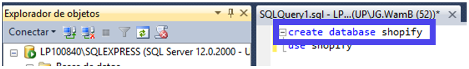
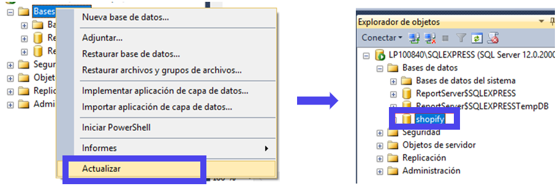

# DDL: Data Definition Language
Sirve para definir las estructuras que almacenarán los datos así como los procedimientos o funciones que permitan consultarlos: create, alter y drop.

### 3.	Crear y Eliminar Bases de Datos
•	Ingresamos create database [nombre de la base de datos] y ejecutamos.
    
   
 
•	Para actualizar la base de datos, damos click derecho en “Base de Datos” y click a “Actualizar”. Ahora podemos visualizar la nueva base de datos.

   

•	Para poder realizar modificaciones en la base de datos, se debe trabajar dentro de ella. Ingresar la sentencia use [nombre de la base de datos] y ejecutamos. Para confirmar, verificar que en la parte superior se encuentra el nombre de la base de datos.

   

•	De haber algún inconveniente y de ser necesario eliminar la base de datos hacemos lo siguiente: Primero, nos ubicamos en otra base de datos con el comando anterior (por lo general use master). Segundo verificamos que ya salimos. Tercero, digitamos la sentencia drop database [nombre de la base de datos]. Por último, actualizamos “Bases de datos” como en el paso 2, donde ya no deberíamos visualizarla.

    

### 4.	Crear Tablas
•	Caso: La librería UP tiene las tablas mostradas debajo. Se sabe que un cliente puede comprar varios libros, y un libro puede ser comprado por varios clientes, por lo que la relación es de muchos a muchos entre ambas tablas (N:M). La tabla entre ambas es la de compra, la cual nos servirá para poder mostrar la relación e ingresar los datos.

    

•	Tablas Entidades:
En una nueva consulta ingresamos las siguientes sentencias, para crear las tablas que necesitaremos.
 
   

•	Tabla Relación:
La clave primaria de la relación se originará de ambas claves primarias de las tablas. Para que se pueda establecer la relación, las claves foráneas también son atributos.

   
 

### 5.	Modificar y Eliminar Tablas

•	Del caso anterior, sabemos que algunos libros son actualizados cada cierto período y se publican nuevas ediciones. Cada vez que requeramos añadir un nuevo atributo a una tabla, usaremos el comando:
alter table [nombreTabla] add [nombreAtributo] [tipoDato];

Añadiremos esta sentencia para agregar el atributo “edición” fuera de las sentencias de la tabla “Libro”.
 
  

•	Más adelante conoceremos un comando que emplearemos todo el tiempo, solo por esta ocasión verificaremos de la siguiente manera que se agregó exitosamente el atributo: Nos dirigimos a “Shopify” > Tablas > dbo.libro (o el nombre de tabla asignado) > Columnas. Al final de esta ruta está el nuevo atributo.

   

•	De haber algún inconveniente y de ser necesario eliminar alguna de las tablas, digitamos el comando  drop table [nombreTabla];. Supongamos que creamos la tabla “Librería”, entonces procederemos a eliminarla.

    
 

 

## Herramientas Tecnlógicas
<a href="https://fing-up.github.io/Ingenieria-de-datos/sql/LV.html">I.   Laboratorio Virtual</a>

## Contenido:

<a href="https://fing-up.github.io/Ingenieria-de-datos/sql/Introduccion.html">I.	Introducción a SQL</a>

<a href="https://fing-up.github.io/Ingenieria-de-datos/sql/GenerarDiagramas.html">II.	Generar Diagramas</a>

III.	DDL: Data Definition Language

<a href="https://fing-up.github.io/Ingenieria-de-datos/sql/DML.html">IV.	DML: Data Manipulation Language</a>

<a href="https://fing-up.github.io/Ingenieria-de-datos/sql/CD.html">V.	Consultas Condicionales</a>

<a href="https://fing-up.github.io/Ingenieria-de-datos/sql/CB.html">VI.	Consultas Básicas</a>

<a href="https://fing-up.github.io/Ingenieria-de-datos/sql/CA.html">VII.	Consultas Agrupada</a>

## Consultas y Enuncidaos

<a href="https://fing-up.github.io/Ingenieria-de-datos/sql/Enunciados&Consultas.html">Consultas y Enunciados</a>

